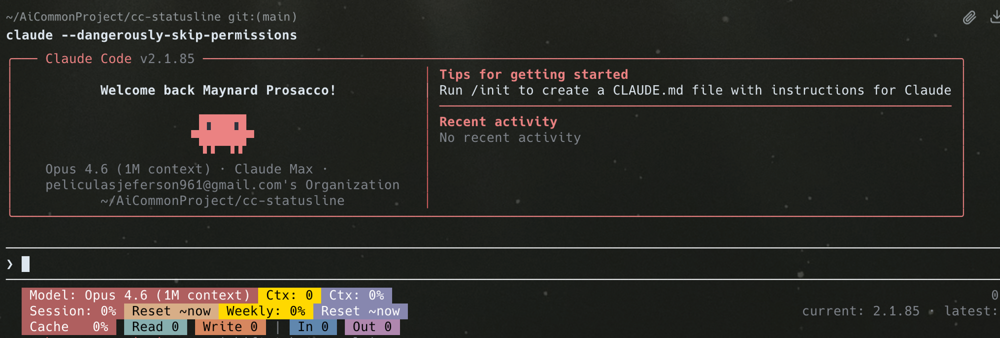

# cc-statusline

A lightweight Powerline-style status line for [Claude Code](https://claude.ai/code), focused on **prompt cache monitoring** and **usage tracking**.



## Features

- **Prompt Cache Hit Rate** — real-time cache hit percentage with color-coded alerts (green/yellow/red)
- **Token Breakdown** — cache read, cache write, input, and output tokens per request
- **Session Usage** — 5-hour session usage percentage with reset countdown
- **Weekly Usage** — 7-day usage percentage with reset countdown
- **Context Window** — total tokens used and context percentage
- **Model Info** — current model name
- **Powerline Style** — clean arrow separators with color-coded segments
- **Zero Dependencies** — pure bash, only requires `jq` and `bc`

## Layout

```
Line 1:  Model: Opus 4.6 (1M context) ► Ctx: 503.8k ► Ctx: 7%
Line 2:  Session: 14% ► Reset ~3h50m ► Weekly: 10% ► Reset ~5d 21hr 50m
Line 3:  Cache  97%   Read 68.3k   Write 1.7k  |  In 1   Out 126
```

### Cache Hit Rate Colors

| Color | Hit Rate | Meaning |
|-------|----------|---------|
| 🟢 Green | ≥ 70% | Healthy — cache is working well |
| 🟡 Yellow | 40-70% | Warning — cache partially effective |
| 🔴 Red | < 40% | Alert — cache mostly missing, tokens burning fast |

## Install

**One-liner:**

```bash
curl -fsSL https://raw.githubusercontent.com/Program120/cc-statusline/main/install.sh | bash
```

**Manual:**

```bash
# Download the script
curl -fsSL https://raw.githubusercontent.com/Program120/cc-statusline/main/statusline.sh -o ~/.claude/statusline.sh
chmod +x ~/.claude/statusline.sh

# Add to ~/.claude/settings.json
# "statusLine": {"type": "command", "command": "~/.claude/statusline.sh", "padding": 0}
```

Restart Claude Code after installation.

## Requirements

- [Claude Code](https://claude.ai/code) v2.1.0+
- `jq` — JSON processor
- `bc` — calculator (usually pre-installed)
- A terminal with [Nerd Font](https://www.nerdfonts.com/) or Powerline font for arrow separators

## Why Cache Hit Rate Matters

Claude Code uses [prompt caching](https://docs.anthropic.com/en/docs/build-with-claude/prompt-caching) to reduce token consumption. Cached tokens cost **1/10th** of regular input tokens. When cache hit rate drops, your usage quota burns much faster.

Common causes of low cache hit rate:
- Claude Code version updates (system prompt changes invalidate cache)
- Long gaps between requests (cache expires after ~5 minutes)
- Switching between different projects/directories

## Uninstall

```bash
rm ~/.claude/statusline.sh
# Then remove the "statusLine" section from ~/.claude/settings.json
```

## License

MIT
