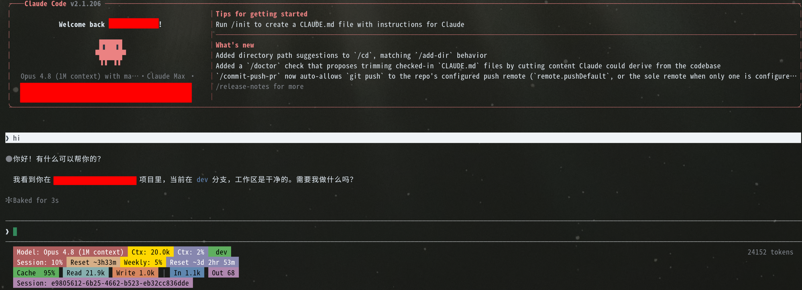

# cc-statusline

A lightweight Powerline-style status line for [Claude Code](https://claude.ai/code), focused on prompt-cache monitoring, usage tracking, and an optional Codex weekly-quota snapshot.



## Features

- **Prompt Cache Hit Rate** — cache-read percentage with color-coded alerts
- **Token Breakdown** — cache read/write, input, and output tokens
- **Claude Usage** — session and weekly percentages when Claude Code provides them
- **Codex Weekly Quota** — remaining percentage and reset countdown from a redacted local snapshot
- **Context Window** — occupied tokens and context percentage
- **Live Reasoning Effort** — the effective `low`, `medium`, `high`, `xhigh`, or `max` value for the current session
- **Model, Git Branch, and Session ID** — including live branch updates with `refreshInterval`
- **Transient-zero Protection** — keeps the last valid per-session metrics when an intermediate refresh contains synthetic zeroes

## Layout

```text
Line 1:  Model: Opus 4.8 (1M) ► Effort: xhigh ► Ctx: 503.8k ► Ctx: 7% ► main
Line 2:  Session: 14% ► Reset ~3h50m ► Weekly: 10% ► Reset ~5d ► Codex W: 68% left ► Reset ~5d
Line 3:  Cache  97%   Read 68.3k   Write 1.7k  |  In 1   Out 126
Line 4:  Session: 0f9c2a71-4d3e-4b8a-9c15-6e2b7a04d8f3
```

Claude and Codex percentages intentionally have different labels: Claude Code supplies used percentages, while `Codex W` explicitly shows the percentage **left**. `Codex W*` means the last successful snapshot is older than 15 minutes. It is hidden after 60 minutes or once its reset time has passed.

`Effort` comes directly from the live `.effort.level` field in Claude Code's statusline input. It reflects the effective session value, including mid-session `/effort` changes; the script does not infer it from settings, environment variables, CC Switch, or the model name. The segment is hidden when the model does not support effort, the field is unavailable, or its value is invalid. Claude Code's separate `.thinking.enabled` boolean is intentionally not shown because it is not an effort level.

## How the Codex quota integration works

The one-second statusline command never launches Codex or accesses the network. A separate helper runs `codex app-server --stdio` every five minutes and calls the official `account/rateLimits/read` RPC. It selects the main `codex` bucket's 10,080-minute window rather than assuming `primary` or `secondary` has a fixed meaning.

Only this redacted schema is written to `${XDG_CACHE_HOME:-~/.cache}/cc-statusline/codex-quota.json`:

```json
{
  "schema_version": 1,
  "fetched_at": 1784800000,
  "weekly": {
    "remaining_percent": 68,
    "window_duration_mins": 10080,
    "resets_at": 1785282605
  }
}
```

The cache never contains tokens, cookies, email addresses, account IDs, credits, or the raw RPC response. Its directory is mode `0700` and the file is `0600`. A failed refresh leaves the last good snapshot untouched.

The RPC is still marked experimental by Codex. This integration was verified with Codex CLI **0.145.0** and fails closed: an unsupported response, missing login, timeout, or network error only hides the Codex segment.

## Requirements

Core statusline:

- Claude Code v2.1.0+; v2.1.119+ is required for the live Effort segment (verified with v2.1.218)
- Bash, `jq`, and `bc`
- `git` is optional and only needed for the branch segment
- A Nerd Font or Powerline font for separators

Optional Codex quota:

- Codex CLI with a valid login
- Python 3 (standard library only)
- Linux user systemd for automatic five-minute refresh; other systems can run the helper manually

## Install

The default installer writes `~/.claude/statusline.sh`, preserves unrelated settings, and enables the optional Codex timer when its dependencies are available:

```bash
curl -fsSL https://raw.githubusercontent.com/Program120/cc-statusline/main/install.sh | bash
```

### CC Switch users

CC Switch can restore and reapply its own Claude configuration. Install files without changing the live `settings.json`:

```bash
curl -fsSL https://raw.githubusercontent.com/Program120/cc-statusline/main/install.sh | bash -s -- --no-config
```

Then save this through CC Switch's **common Claude configuration UI**, not by editing its SQLite database:

```json
"statusLine": {
  "type": "command",
  "command": "bash /absolute/path/to/.claude/statusline.sh",
  "padding": 0,
  "refreshInterval": 1
}
```

If CC Switch is actively proxying Claude, verify its common config, recovery backup, and live `~/.claude/settings.json` all retain the same statusLine after saving.

### Manual statusline install

```bash
mkdir -p ~/.claude
curl -fsSL https://raw.githubusercontent.com/Program120/cc-statusline/main/statusline.sh -o ~/.claude/statusline.sh
chmod 0755 ~/.claude/statusline.sh
```

Add the statusLine object above to `~/.claude/settings.json`, using the real absolute path.

### Manual Codex refresh

When user systemd is unavailable, the installer still installs the helper and prints an exact command. The generic form is:

```bash
CODEX_BIN=/absolute/path/to/codex \
python3 "${XDG_DATA_HOME:-$HOME/.local/share}/cc-statusline/libexec/codex-quota-refresh.py"
```

The Codex segment remains hidden until a valid cache exists. The installer does not modify cron or launchd automatically.

## Live branch updates

Claude Code normally reruns the statusline after events. `refreshInterval: 1` also updates it while the session is idle, so a branch switch in another terminal appears without waiting for another message. Increase it to 2 or 3 seconds if preferred, or omit it for event-only rendering.

## Cache hit rate

The hit percentage is:

```text
cache_read / (input + cache_read + cache_creation)
```

| Color | Hit rate |
|---|---:|
| Green | ≥70% |
| Yellow | 40–69% |
| Red | <40% |

## Troubleshooting

```bash
codex --version
systemctl --user status cc-statusline-codex-quota.service
systemctl --user list-timers cc-statusline-codex-quota.timer
journalctl --user -u cc-statusline-codex-quota.service
```

The helper deliberately logs only failure categories; it does not log the raw app-server response. A transient failure should not change the existing cache file.

## Uninstall

Run the repository's uninstaller:

```bash
bash uninstall.sh
```

It removes the timer and helper, but leaves `~/.claude/statusline.sh` in place when ownership cannot be proven. It only removes a matching statusLine setting and never deletes the entire settings file. Add `--no-config` for CC Switch-managed configuration, and `--purge` to remove the redacted quota cache as well.

## Development

```bash
bash -n statusline.sh install.sh uninstall.sh
python3 -m unittest discover -s tests -v
```

The test suite uses a synthetic app-server and synthetic session IDs; no real account response is committed.

## License

MIT
